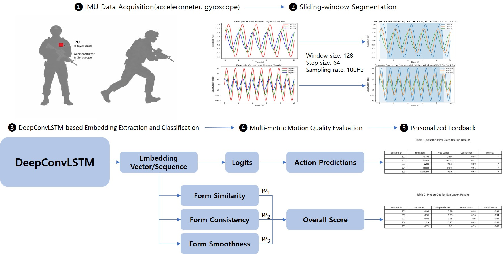

# DeepMILES

**Deep Learning Model for Integrated Evaluation of Soldier-Specific Performance**

DeepMILES is a deep learning framework for **Human Activity Recognition (HAR)** from IMU (Inertial Measurement Unit) sensor data, designed for evaluating military-relevant tactical movements. Beyond classification, it provides a **multi-metric motion quality scoring system** that gives actionable, personalized feedback to soldiers.

---

## Framework Overview

<p align="center">
  
</p>

The pipeline consists of five stages:

1. **IMU Data Acquisition** — Raw accelerometer and gyroscope data collected at 100 Hz
2. **Sliding-window Segmentation** — Windows of 128 samples with 64-sample stride (50% overlap)
3. **DeepConvLSTM-based Embedding Extraction and Classification** — Hybrid CNN-LSTM model produces both action predictions and 128-dimensional embeddings
4. **Multi-metric Motion Quality Evaluation** — Embeddings scored across three dimensions: Form Similarity, Temporal Consistency, and Embedding Smoothness
5. **Personalized Feedback** — A weighted overall quality score per session

---

## Recognized Actions (6 Classes)

| Label | Description |
|---|---|
| `bomb` | Prone action |
| `crawl` | Low crawling |
| `hide` | Cover and concealment |
| `kneelingshot` | Kneeling rifle shot |
| `standby` | Standing alert position |
| `walk` | Tactical footwork |

---

## Repository Structure

```
DeepMILES/
├── MILES/                          # Source code
│   ├── model.py                    # DeepConvLSTM architecture
│   ├── model_cnn_only.py           # CNN-only ablation variant
│   ├── model_lstm_only.py          # LSTM-only ablation variant
│   ├── dataset.py                  # IMU dataset loader (6-channel)
│   ├── dataset_acc_only.py         # Accelerometer-only dataset
│   ├── train.py                    # Main training script
│   ├── train_cnn_only.py           # CNN-only training
│   ├── train_lstm_only.py          # LSTM-only training
│   ├── train_acc_only.py           # Accelerometer-only training
│   ├── configs.py                  # Centralized configuration
│   ├── make_split.py               # Train/val/test split generator
│   ├── windows_calc.py             # Sliding window statistics
│   ├── emb_ext.py                  # Embedding extraction (6-channel)
│   ├── emb_ext_acc_only.py         # Embedding extraction (acc-only)
│   ├── template_and_score.py       # Template building & multi-metric evaluation
│   ├── template_and_score_acc_only.py
│   ├── comparison.py               # Pairwise action comparison utility
│   └── data2plot.py                # Visualization helper
├── dataset/                        # Raw IMU sensor CSV files
│   ├── bomb{1-5}/, bomb_test/
│   ├── crawl{1-5}/, crawl_test/
│   ├── hide{1-5}/, hide_test/
│   ├── kneelingshot{1-5}/, kneelingshot_test/
│   ├── standby{1-5}/, standby_test/
│   └── walk{1-5}/, walk_test/
├── model/                          # Saved model weights
├── csv/                            # Metadata CSV files
└── figure/                         # Framework diagram
```

---

## Model Architecture

### DeepConvLSTM

The core model (`MILES/model.py`) is a hybrid convolutional-recurrent network:

```
Input: (batch, 1, 128, 6)   # 1 channel, 128 time steps, 6 sensors

Conv Block (4 layers):
  Conv2d(1 → 64, kernel 5×1) → ReLU
  Conv2d(64 → 64, kernel 5×1) → ReLU
  Conv2d(64 → 64, kernel 5×1) → ReLU
  Conv2d(64 → 64, kernel 5×1) → ReLU

Reshape: (batch, seq_len, 64×6)

LSTM: 2 layers, 128 hidden units

Output (classification):   Dropout(0.5) → Linear(128 → 6) → Logits
Output (embedding):        LSTM last hidden state (128-dim vector)
```

The `return_embeddings=True` flag in `forward()` switches the model to embedding mode, which is used for the downstream quality evaluation pipeline.

### Ablation Variants

| Model | File | Description |
|---|---|---|
| DeepConvLSTM | `model.py` | Full model (CNN + LSTM) |
| CNNOnly | `model_cnn_only.py` | 4 conv layers + global average pooling |
| LSTMOnly | `model_lstm_only.py` | 2-layer LSTM directly on raw input |
| AccOnly | `model.py` + `dataset_acc_only.py` | Full model on 3-channel (accel only) input |

---

## Dataset Format

### Raw IMU Files

Each session folder contains CSV files with the following columns:

```
time, seconds_elapsed, acc_x, acc_y, acc_z, gyro_x, gyro_y, gyro_z
```

Sampling rate: **100 Hz**

### Metadata CSV (`metadata_train.csv`, etc.)

```
session_id, start_time, end_time, label
```

### Session CSV (`session.csv`)

```
session_id, file_path, soldier_id, label, fs_hz, notes
```

---

## Configuration

All hyperparameters are defined in `MILES/configs.py`:

```python
# Data
WINDOW_SIZE = 128       # samples (~1.28 s at 100 Hz)
STEP_SIZE   = 64        # 50% overlap
INPUT_CHANNELS = 6      # acc_x, acc_y, acc_z, gyro_x, gyro_y, gyro_z

# Model
CONV_KERNELS = 64
LSTM_UNITS   = 128
NUM_CLASSES  = 6

# Training
BATCH_SIZE     = 32
LEARNING_RATE  = 0.001
EPOCHS         = 30
DROPOUT        = 0.5
```

---

## Usage

### 1. Prepare Data Splits

```bash
cd MILES
python make_split.py
```

Generates `metadata_train.csv`, `metadata_val.csv`, and `metadata_test.csv` from the session metadata.

### 2. Train the Model

```bash
# Full DeepConvLSTM (6-channel)
python train.py

# CNN-only ablation
python train_cnn_only.py

# LSTM-only ablation
python train_lstm_only.py

# Accelerometer-only
python train_acc_only.py
```

Best model weights are saved to `har_model.pth` based on validation accuracy.

### 3. Extract Embeddings

```bash
# 6-channel model
python emb_ext.py

# Accelerometer-only model
python emb_ext_acc_only.py
```

Outputs per-session `.npz` archives containing embedding arrays and class probability predictions.

### 4. Template-Based Evaluation

```bash
python template_and_score.py
```

Builds canonical action templates from training embeddings and scores test sessions. Outputs a `scores.csv` with per-session results.

---

## Evaluation Metrics

The template-based scoring evaluates each session across three dimensions:

| Metric | Weight | Description |
|---|---|---|
| **Form Similarity** | 50% | Cosine similarity between session mean embedding and the canonical template vector for that action class |
| **Temporal Consistency** | 30% | DTW distance between session embedding sequence and the exemplar template sequence, normalized to [0, 1] |
| **Embedding Smoothness** | 20% | Average cosine similarity between consecutive window embeddings within a session (measures motion stability) |
| **Overall Score** | — | Weighted sum of the three metrics above |

### Output CSV Columns

| Column | Description |
|---|---|
| `session_id` | Session identifier |
| `true_label` | Ground truth action class |
| `pred_label` | Predicted action class (majority vote over windows) |
| `pred_conf` | Prediction confidence |
| `is_correct` | 1 if prediction matches true label |
| `num_windows` | Number of sliding windows in session |
| `form_similarity` | [0, 1] form score |
| `temporal_consistency` | [0, 1] temporal rhythm score |
| `embedding_smoothness` | [0, 1] within-session stability |
| `overall_score` | Weighted quality metric |

---

## Dependencies

```
torch
numpy
pandas
scikit-learn
scipy
fastdtw
matplotlib
```

Install with:

```bash
pip install torch numpy pandas scikit-learn scipy fastdtw matplotlib
```
